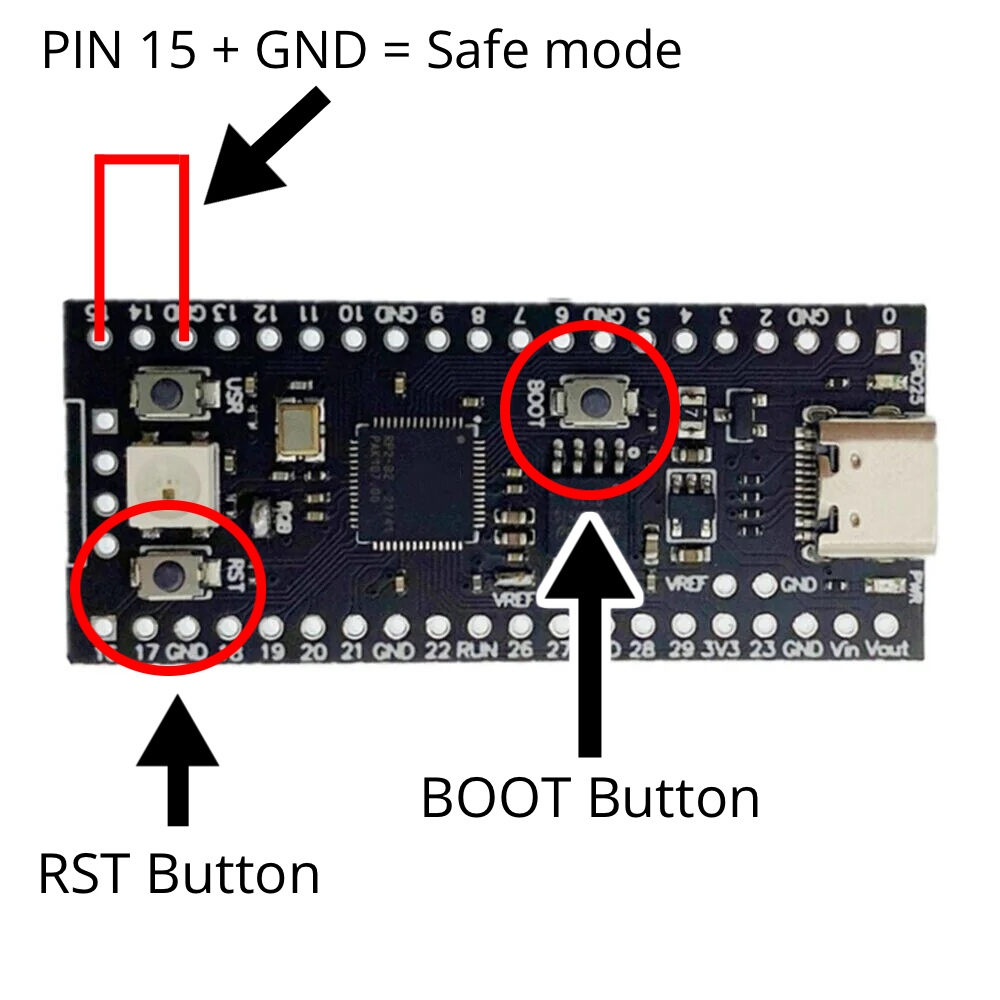

<h1 align="center">BadPiCo</h1>

<div align="center">
  <strong>A USB HID keystroke injector for the Raspberry Pi Pico. Plug it in and it types a stored payload automatically. Edit the payload over USB without reflashing.</strong>
</div>

# Getting started

1. Download the latest .UF2 release from the release page.
2. Plug in the Pico whilst holding the Boot button, it will show up as a removable media device named RPI-RP2.
3. Copy over the .UF2 file you downloaded to the root of the Pico, it should restart and the firmware should be installed!

# Editing the payload

- Ground the PIN 15 on the Pico using a jumper wire or some kind of metal piece (Reference to the image below).
- While it is grounded, press the RST button on the board, it should restart and the Pico should show up as a media device containing the PAYLOAD.TXT file.
-  Open up the file using your preferred text editor and type in your payload (DuckyScript is not supported as of now).
- The Blue LED on the board should flash 3 times once you hit save on your editor, make sure it flashes otherwise the payload might not have been saved.
- Take out the wire between PIN 15 and the payload will execute on boot everytime it is plugged into a device.



# Building

**Requirements**
- CMake & Make
- GCC (arm-none-eabi)
- Pico-SDK

Pico-SDK is already located in /lib but if you want to download yourself, check out their [repo](https://github.com/raspberrypi/pico-sdk)! (Don't forget to change the PICO_SDK_PATH to your own path)

```bash
git clone https://github.com/ooqeDev/BadPICo
cd BadPiCo
export PICO_SDK_PATH=/lib/pico-sdk
mkdir build
cd build
cmake ..
make -j4
```


